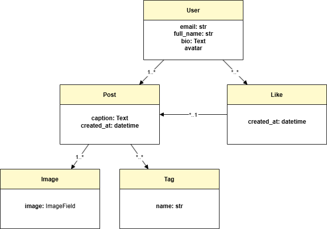

# ContentFlow Architecture Overview

This document provides a high-level overview of the architecture, core components, and relationships of the ContentFlow project. It complements the main `README.md` and helps new developers or reviewers understand how the system is structured.

---

## Purpose

ContentFlow is a Django-based social media application that allows users to register, create posts with images and hashtags, like posts, and view a personalized feed. The project is optimized for production deployment using AWS and supports frontend interactivity via Vanilla JS and unit testing with Jest.

---

## UML Class Diagram

The UML diagram below shows how the core models relate:

`docs/uml_class_diagram_contentflow.drawio`



Classes:

* **User**: Custom user model with avatar, bio, email, etc.
* **Post**: Created by users; linked to tags; contains multiple images.
* **Image**: Linked to a single post.
* **Tag**: Many-to-many relationship with Post.
* **Like**: Tracks which users liked which posts.

---

## Core Components

### Django Apps:

* `users/`: Handles authentication, profile updates, avatar upload.
* `posts/`: Core app with Post, Tag, Image models and logic.
* `likes/`: AJAX like/unlike handlers.
* `core/`: Base routes like homepage.
* `seed/`: Fake data management via custom `seed_data` command.

### Static & Media:

* `static/js/`: Contains modular JS files (like-toggle.js, modal.js, etc.)
* `media/`: Stores uploaded media in DEBUG mode; in production, uses S3.

### Templates:

* HTML templates grouped by context (users, posts, base.html).

---

## Frontend Stack

* Written in **Vanilla JavaScript**
* Modular logic for likes, modals, post dropdowns, and time formatting
* Frontend tests written in Jest

See: [docs/frontend-testing.md](frontend-testing.md)

---

## Functional Highlights

### User Features

* Registration with form validation
* Profile page with list of user posts
* Profile editing (username, avatar, bio)

### Post Management

* Create post with caption and up to 5 images
* Automatic hashtag extraction from caption (e.g., #django)
* Edit and delete posts
* Post thumbnails generated for preview modal

### Feed & Tags

* Feed of all posts with most recent first
* Clickable tag-based filtering
* Local time display via JavaScript conversion

### Media & Thumbnails

* Uploaded images saved to `/media/posts/`
* Thumbnails stored for faster preview rendering
* Images deleted when parent post is deleted

### Hashtag Logic

* Hashtags extracted and saved as `Tag` models
* Displayed as links under each post
* In-caption hashtags are linkified separately

### Local Time Display

* Post creation time is saved in UTC
* Converted to local browser time using:

  * HTML: `<span data-utc=\"...\">`
  * JS: `toLocaleString()` with fallback formatting

---

## Fake Data Generation

The `seed_data` management command is implemented as a Django custom command located in `seed/management/commands/seed_data.py`.

It is designed to:

* Create N users (`userX@example.com`)
* For each user, generate 2–5 posts with:

  * Random captions
  * 1–3 images per post (using Pillow and random image generation)
  * Auto-generated thumbnails
* Extract hashtags from captions and create/reuse Tag instances
* Clean up media files from `/media/` and orphaned tags when using `--clear`

This tool supports rapid development and demo seeding, and is excluded from production usage.

---

## S3 + CloudFront Configuration

In production mode (`DEBUG=False`), static and media files are stored in AWS S3 and served through CloudFront.

The file `contentflow/storage_backends.py` defines two custom storage backends:

* `StaticStorage`: handles files under the `static/` prefix.
* `MediaStorage`: handles user uploads under the `media/` prefix.

Django uses these classes conditionally depending on the `DEBUG` setting.

### Folder & URL Mapping

| File Type | S3 Folder | CloudFront URL                                                                   |
| --------- | --------- | -------------------------------------------------------------------------------- |
| Static    | static/   | [https://your-cloudfront-domain/static/](https://your-cloudfront-domain/static/) |
| Media     | media/    | [https://your-cloudfront-domain/media/](https://your-cloudfront-domain/media/)   |

> Environment keys required for this configuration are listed in the [Configuration & Environment](#configuration--environment) section.

---

### Database & Storage Settings (in settings.py)

Database configuration is managed using environment variables loaded via `python-decouple`:

```
DATABASES = {
    'default': {
        'ENGINE': 'django.db.backends.postgresql',
        'NAME': config('DB_NAME'),
        ...
    }
}
```

Static and media storage depends on the DEBUG flag:

```
STATICFILES_DIRS = [BASE_DIR / "static"]

if DEBUG:
    STATIC_URL = "/static/"
    MEDIA_URL = "/media/"
    MEDIA_ROOT = BASE_DIR / "media"
else:
    STATICFILES_STORAGE = 'contentflow.storage_backends.StaticStorage'
    DEFAULT_FILE_STORAGE = 'contentflow.storage_backends.MediaStorage'
    STATIC_URL = f'https://{AWS_S3_CUSTOM_DOMAIN}/static/'
    MEDIA_URL = f'https://{AWS_S3_CUSTOM_DOMAIN}/media/'
```

These values are determined by .env variables such as AWS_S3_CUSTOM_DOMAIN, etc.


## Security Configuration

In production, Django and NGINX work together to enforce HTTPS and protect user sessions.

### Django Settings

```python
SECURE_SSL_REDIRECT = True
CSRF_COOKIE_SECURE = True
SESSION_COOKIE_SECURE = True
SECURE_HSTS_SECONDS = 31536000
SECURE_HSTS_INCLUDE_SUBDOMAINS = True
SECURE_HSTS_PRELOAD = True
SECURE_PROXY_SSL_HEADER = ('HTTP_X_FORWARDED_PROTO', 'https')
```

These settings enforce secure cookie handling, HSTS headers, and redirect all traffic to HTTPS. The proxy header ensures Django recognizes the request as secure when passed through NGINX or AWS ELB.

### NGINX Configuration

```nginx
server {
    listen 80;
    server_name yourdomain.com;

    return 301 https://$host$request_uri;
}

server {
    listen 443 ssl;
    server_name yourdomain.com;

    ssl_certificate /path/to/your/certificate.crt;
    ssl_certificate_key /path/to/your/private.key;

    location = /favicon.ico { access_log off; log_not_found off; }

    location / {
        proxy_pass http://unix:/home/ubuntu/your-project/gunicorn.sock;
        proxy_set_header Host $host;
        proxy_set_header X-Real-IP $remote_addr;
        proxy_set_header X-Forwarded-For $proxy_add_x_forwarded_for;
        proxy_set_header X-Forwarded-Proto $scheme;
    }
}
```

---

## Deployment Infrastructure Overview

ContentFlow is deployed using a modern production stack:

* **AWS EC2**: Virtual machine hosting the Django app
* **Gunicorn**: WSGI server running the Django backend
* **NGINX**: Reverse proxy and HTTPS handler
* **AWS RDS (PostgreSQL)**: Hosted relational DB
* **AWS S3**: Storage for static and media files
* **AWS CloudFront**: CDN for fast content delivery
* **Certbot**: Free HTTPS via Let's Encrypt

---

### Gunicorn Service File (systemd)

Place this in `/etc/systemd/system/gunicorn.service`:

```ini
[Unit]
Description=Gunicorn daemon for ContentFlow
After=network.target

[Service]
User=ubuntu
Group=www-data
WorkingDirectory=/home/ubuntu/your-project
EnvironmentFile=/home/ubuntu/your-project/.env
ExecStart=/home/ubuntu/your-project/venv/bin/gunicorn \
    --workers 3 \
    --bind unix:/home/ubuntu/your-project/gunicorn.sock \
    contentflow.wsgi:application

[Install]
WantedBy=multi-user.target
```

---

### NGINX Site Config (contentflow\.conf)

Use this configuration to reverse proxy requests to Gunicorn and serve HTTPS:

*(see Security Configuration section for a full example)*

---

## Configuration & Environment

Environment settings are managed via `.env` file, loaded using `python-decouple`. Production uses PostgreSQL + S3 + SMTP; local uses SQLite and console email backend.

`.env.example` contains:

```
# Django configuration
DEBUG=False
SECRET_KEY=your-production-secret-key
ALLOWED_HOSTS=your-ip-address,your-domain.com,your-cloudfront-domain,127.0.0.1,localhost

# PostgreSQL (AWS RDS or local setup)
DB_NAME=your-database-name
DB_USER=your-database-user
DB_PASSWORD=your-database-password
DB_HOST=your-database-host
DB_PORT=5432

# AWS S3 & CloudFront
AWS_ACCESS_KEY_ID=your-aws-access-key-id
AWS_SECRET_ACCESS_KEY=your-aws-secret-access-key
AWS_STORAGE_BUCKET_NAME=your-s3-bucket-name
AWS_S3_REGION_NAME=your-region (e.g., eu-north-1)
AWS_S3_CUSTOM_DOMAIN=your-cloudfront-domain.cloudfront.net

# Email (SMTP)
EMAIL_HOST=your-smtp-host
EMAIL_PORT=your-smtp-port
EMAIL_HOST_USER=your-smtp-username
EMAIL_HOST_PASSWORD=your-smtp-password
EMAIL_USE_TLS=True
DEFAULT_FROM_EMAIL=noreply@contentflow.com
```

## Summary

ContentFlow is a full-stack Django application with production-ready deployment, modular frontend components, S3-based storage, and clear architecture documentation. This file supplements the main `README.md` with a deeper structural view for future maintainers.
